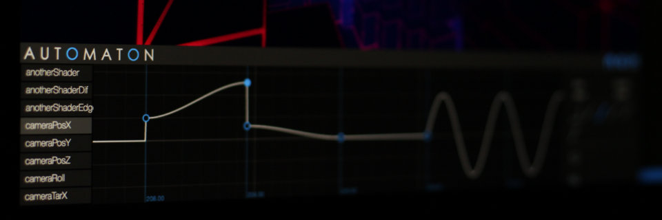

# Automaton

Animation tool with Timeline GUI for art coding

made for [Shift](https://GitHub.com/fms-cat/shift), my WebGL demo

---

## TODO

- [ ] Write README
- [ ] Make some cool tutorial
- [ ] Add about screen
- [ ] Range select and batch change for timeline nodes
- [ ] Improve UI
- [ ] Add feature for minify (for low-byte demos!)
