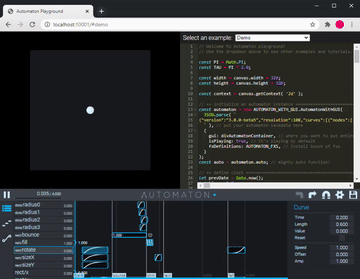

   

  Animation engine for creative coding

Originally made for [Shift](https://GitHub.com/0b5vr/shift), my WebGL demo

## Playground! (Tutorial)

Try our playground!
It comes with bunch of examples.

[https://0b5vr.github.io/automaton/automaton-with-gui](https://0b5vr.github.io/automaton/automaton-with-gui)

You might want to also check examples of [the core package](https://github.com/0b5vr/automaton/tree/dev/packages/automaton).

## What is this

Automaton is an animation engine for creative coding.
While you're doing creative coding, doing time-based animation by code sometimes causes you so much pain.
This project provides a framework and its GUI to connect your coding pieces with animations.

It's intended to be used in 64k intro, so I'm trying my best to make its footprint as small as possible.
The package [`automaton`](./packages/automaton) have a minimal set of features that is required to play animations and it does not have any dependencies.
The package [`automaton-with-gui`](./packages/automaton-with-gui) intended to be used in development stage is pretty big since it contains third party codes like React.

## Packages

- [`@0b5vr/automaton`](./packages/automaton) 
  - Core package of the automaton
- [`@0b5vr/automaton-fxs`](./packages/automaton-fxs) 
  - A package that contains bunch of automaton fxs
- [`@0b5vr/automaton-fxs-v2compat`](./packages/automaton-fxs-v2compat) 
  - A package that contains Automaton v2 compatibility fxs
- [`@0b5vr/automaton-with-gui`](./packages/automaton-with-gui) 
  - A variant of automaton that comes with GUI!

## Friend projects

- [automaton-electron](https://github.com/0b5vr/automaton-electron)
  - Electron client of automaton
- [automaton-lua](https://github.com/0b5vr/automaton-lua)
  - Lua binding of automaton

## Have a problem?

There are pretty much no users other than me so lacks documents if you want to use.
Please feel free to ask questions on [Twitter](https://twitter.com/0b5vr) ❤

## License

[MIT](./LICENSE)
