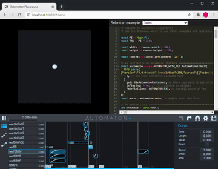

# automaton-with-gui

[](https://www.npmjs.com/package/@0b5vr/automaton-with-gui)

Animation engine for creative coding, with GUI!

It's an extended variant of the original [Automaton](https://github.com/0b5vr/automaton/packages/automaton) engine

Originally made for [Shift](https://GitHub.com/0b5vr/shift), my WebGL demo

## Playground!



Try our playground!
It comes with bunch of examples.

[https://0b5vr.github.io/automaton/automaton-with-gui](https://0b5vr.github.io/automaton/automaton-with-gui)

You might want to also check examples of original [Automaton](https://github.com/0b5vr/automaton/packages/automaton).

## Install

### Include directly

- [`automaton-with-gui.js`](https://0b5vr.github.io/automaton/automaton-with-gui/dist/automaton-with-gui.js)
- [`automaton-with-gui.min.js`](https://0b5vr.github.io/automaton/automaton-with-gui/dist/automaton-with-gui.min.js)
- [`automaton-with-gui.module.js`](https://0b5vr.github.io/automaton/automaton-with-gui/dist/automaton-with-gui.module.js)
- [`automaton-with-gui.module.min.js`](https://0b5vr.github.io/automaton/automaton-with-gui/dist/automaton-with-gui.module.min.js)

`.min` builds are minified. otherwise it isn't minified and comes with source maps.  
`.module` builds are ESM. otherwise it's UMD.  
If you want to use the UMD one using iife, everything is exposed onto global under the name `AUTOMATON_WITH_GUI`.

You might want to use `automaton.min.js` of [the core engine without GUI](https://github.com/0b5vr/automaton/packages/automaton) for production stage.

Code like this:

```js
const { AutomatonWithGUI } = AUTOMATON_WITH_GUI;

const data = await ( await fetch( 'automaton.json' ) ).json();

const automaton = new AutomatonWithGUI(
  data,
  {
    gui: yourDesiredMountpointDOM
  }
);

// ...
```

### npm

[https://www.npmjs.com/package/@0b5vr/automaton-with-gui](https://www.npmjs.com/package/@0b5vr/automaton-with-gui)

```sh
# npm install @0b5vr/automaton-with-gui
yarn add @0b5vr/automaton-with-gui
```

then code like this:

```js
// const { AutomatonWithGUI } = require( '@0b5vr/automaton-with-gui' );
import { AutomatonWithGUI } from '@0b5vr/automaton-with-gui';

const data = await ( await fetch( 'automaton.json' ) ).json();

const automaton = new AutomatonWithGUI(
  data, // it's okay to be `undefined`
  {
    gui: yourDesiredMountpointDOM
  }
);

// ...
```

## Docs

[https://0b5vr.github.io/automaton/automaton-with-gui/docs/](https://0b5vr.github.io/automaton/automaton-with-gui/docs/)

## License

[MIT](https://github.com/0b5vr/automaton/blob/master/LICENSE)
